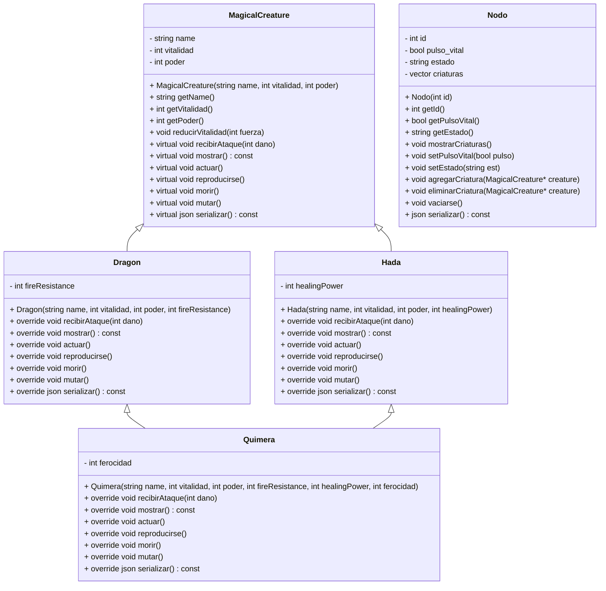

```mermaid
classDiagram

class MagicalCreature {
    - string name
    - int vitalidad
    - int poder
    + MagicalCreature(string name, int vitalidad, int poder)
    + string getName()
    + int getVitalidad()
    + int getPoder()
    + void reducirVitalidad(int fuerza)
    + virtual void recibirAtaque(int dano)
    + virtual void mostrar() const
    + virtual void actuar()
    + virtual void reproducirse()
    + virtual void morir()
    + virtual void mutar()
    + virtual json serializar() const
}

class Dragon {
    - int fireResistance
    + Dragon(string name, int vitalidad, int poder, int fireResistance)
    + override void recibirAtaque(int dano)
    + override void mostrar() const
    + override void actuar()
    + override void reproducirse()
    + override void morir()
    + override void mutar()
    + override json serializar() const
}

class Hada {
    - int healingPower
    + Hada(string name, int vitalidad, int poder, int healingPower)
    + override void recibirAtaque(int dano)
    + override void mostrar() const
    + override void actuar()
    + override void reproducirse()
    + override void morir()
    + override void mutar()
    + override json serializar() const
}

class Quimera {
    - int ferocidad
    + Quimera(string name, int vitalidad, int poder, int fireResistance, int healingPower, int ferocidad)
    + override void recibirAtaque(int dano)
    + override void mostrar() const
    + override void actuar()
    + override void reproducirse()
    + override void morir()
    + override void mutar()
    + override json serializar() const
}

class Nodo {
    - int id
    - bool pulso_vital
    - string estado
    - vector<MagicalCreature*> criaturas
    + Nodo(int id)
    + int getId()
    + bool getPulsoVital()
    + string getEstado()
    + void mostrarCriaturas()
    + void setPulsoVital(bool pulso)
    + void setEstado(string est)
    + void agregarCriatura(MagicalCreature* creature)
    + void eliminarCriatura(MagicalCreature* creature)
    + void vaciarse()
    + json serializar() const
}

MagicalCreature <|-- Dragon
MagicalCreature <|-- Hada
Dragon <|-- Quimera
Hada <|-- Quimera
```
